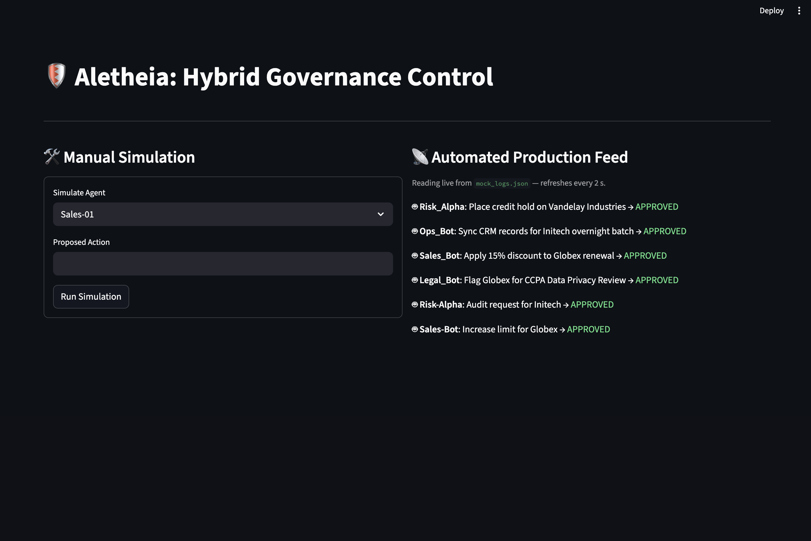
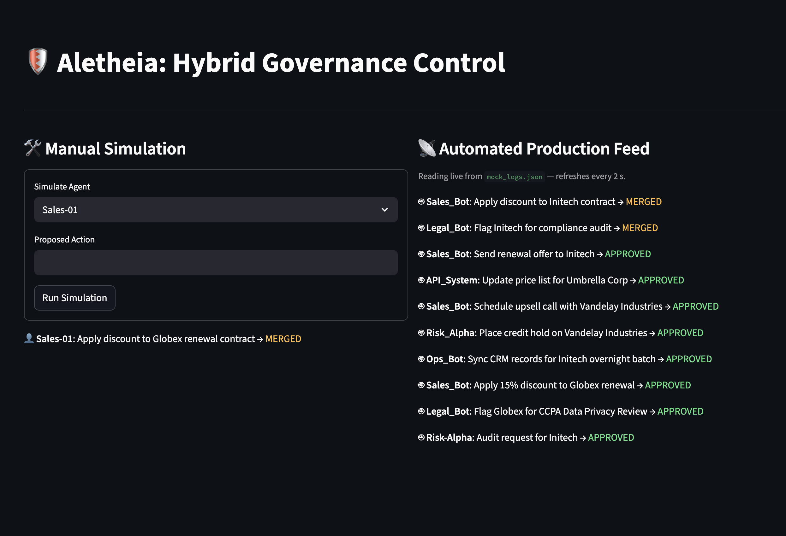

# 🛡️ Aletheia: Proactive Agentic Governance

Aletheia is a hybrid governance engine designed to resolve enterprise data fragmentation and PII duplication in real-time. Built with the **Claude LLM API**, it moves data integrity from a reactive "cleaning" task to a proactive "reasoning" constraint.

## 🚀 Key Architectural Concepts

* **Canonical Entity Resolution**: Utilizing **Taxonomies** to standardize data entry and **Ontologies** to map complex relationships across distributed warehouses.
* **Semantic Interception**: Acting as a "Glass Box" gateway where the engine reconciles "One Truth" before data hits the warehouse, rather than fixing duplicates after the fact.
* **Graph-RAG Integration**: Projecting resolved entities into a Knowledge Graph. This allows downstream systems to traverse ontology-defined relationships and combine structured nodes with unstructured vector retrieval.


## 🛠️ Technical Stack

* **Core Logic**: Python / Pydantic
* **Reasoning Layer**: Claude LLM API
* **Frontend**: Streamlit (Hybrid Manual/Automated Dashboard)
* **Data Structure**: Knowledge Graph (KG) & Canonical Data Models

## 🏃 Getting Started

1.  **Clone the Repo**:
    ```bash
    git clone https://github.com/tranlarry1924/aletheia.git
    cd aletheia
    ```

2.  **Install Dependencies**:
    ```bash
    pip install -r requirements.txt
    ```

3.  **Run the Dashboard**:
    ```bash
    export PYTHONPATH=$PYTHONPATH:.
    python3 -m streamlit run app.py
    ```

4.  **Simulate Automated Traffic**:
    In a separate terminal:
    ```bash
    python3 src/mock_agent_test.py
    ```

## 🏛️ Strategy & Governance
For a deep dive into the business impact, ROI modeling, and 3-year roadmap for this architecture, please see the [Product Strategy Memo](docs/STRATEGY.md).

## System Interface & Logic


*Managing automated production feeds with built-in CCPA compliance flagging.*


*Resolving fragmented entity actions into a Unified Schema using LLM reasoning.*

---
*Developed as a deep-dive exploration into enterprise data reconciliation and Master Data Management (MDM) challenges.*
